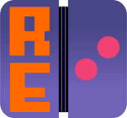

  

# retouched
A reimplementation of Nitrome Touchy and the BrassMonkey server.    
**This is not an officially supported Ntrome Ltd. or Infrared5 Inc. product.**

## Download and usage
**Note: Only possible with Android as of now, unless you can install Touchy on a jailbroken iPhone.**  
[Follow the instructions from here](setup.md)    
As of now, it might be a bit difficult to set it up. Eventually retouched web should be released, but this will take a long time to finish.    
Retouched web will be a recreation of the Touchy app inside a web browser, which will be platform agnostic (as long as the browser is capable enough).

## Protocol documentation
Coming soon.

## License

This project is licensed under the GNU Affero General Public License v3.0.  
See the [LICENSE](LICENSE) file for details.

Images in this repository are licensed under the Creative Commons Attribution 4.0 International License.  
See the [LICENSE-IMAGES.md](LICENSE-IMAGES.md) file for details.

Copyright © 2025 ddavef/KinteLiX  
Both ddavef and KinteLiX refer to the same individual.

## Credits

The project logo uses the font ["Cosimo"](https://fontstruct.com/fontstructions/show/406218/cosimo_1) by Patrick H. Lauke (redux),  
licensed under [Creative Commons Attribution 3.0 Unported](https://creativecommons.org/licenses/by/3.0/).  

This project uses the [Py3AMF](https://github.com/StdCarrot/Py3AMF) Python library by StdCarrot, licensed under the [MIT License](https://github.com/StdCarrot/Py3AMF/blob/master/LICENSE.txt).  

## Troubleshooting
Make sure your firewall is not blocking ports 8088 and 8080 (allow them in your firewall or allow Python and Flash Player).    
Make sure no other app is using ports 8088 and 8080, close them if so.    
